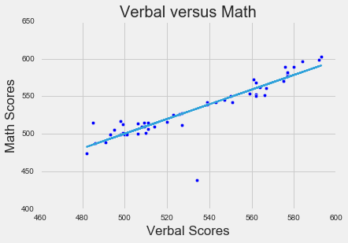
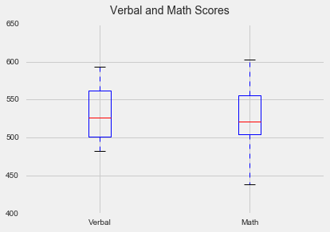
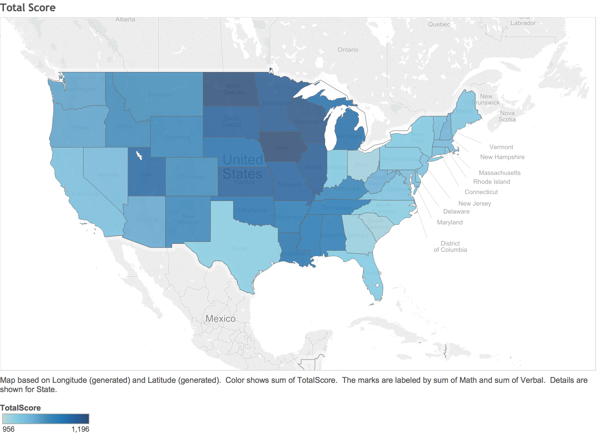

The class performed a series of analyses on the SAT score data set, utilizing the Jupyter notebook and Tableau.  The data was not clearly definied, as we got 3 data series without any explanation - Rate, Verbal, and Math.  We assumed that Rate referred to the participation rate, and the Verbal and Math scores were the average respective scores for the specified state.  From there, we saw that both Verbal and Math appeared to be normally distributed, and the Rates data was bimodally distributed.  There was a strong positive correlation between Verbal and Math, indicating that high scores in one section corresponded to high scores in the other section.  

Both Verbal and Math appeared to be negatively correlated to the Rate - once again, we're not sure what sort of inference we can make from that as the Rate field is not clearly defined.  If we assume that the rate is the participation rate, then the states with a lower participation rate seem to be doing great.  

Finally we graphically represented the total scores nationally to a map of the US.  We see that the midwest does very well on total score, whereas the eastern coast of the US seems to underperform.  

The graphic representation for statewide scores 

That's it for SAT scores, next up is dirty Billboards data...