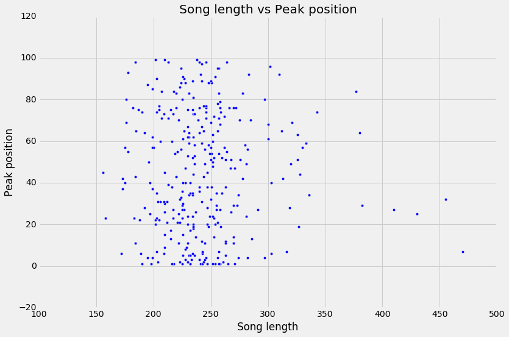
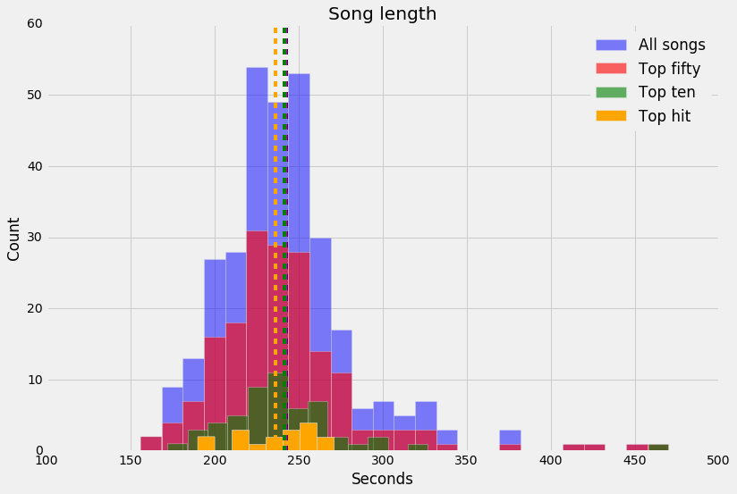

The class performed a series of analyses on the Billboard 2000 chart dataset, utilitzing the Jupyter notebook.   The data required some cleaning and manipulation in order to extract useful information about the songs in 2000; data was manipulated into a format or type with which we could use for analysis, data which had no bearing on our analysis was discarded.  We got a quick feel for the data by performing summary statistics on the dataset and several sub-datasets which we thought were interesting.  After performing several exploratory data visualizations, I decided to take a look at song length and whether it had any effect on peak position, number of weeks to reach peak position, and total number of weeks on the chart.  We took a quick pass on song length against those performance factors, we also took a look at some other sub-datasets against song length.  As seen in the scatter plot below, no apparent relationship appears between song length and the peak position acheived, with an even distribution in the scatter.  

Looking at sub-datasets by peak performance, we see a slight difference in song length.  It appears that songs that peak within the top 10 are slightly shorter in average length, and songs that hit the top spot are even shorter.  One could use these results as justification to look at more in-depth analysis along this theme, perhaps performing more granular analysis by looking at the profile of number one hits and seeing if song length is the one common factor, or if there are other factors involved.

Also going over the summary statistics we performed at the onset, it does seem that average song length decreases as you go from the total dataset to the top 50 to the top 10 and then examining number one hits.  We performed some further analysis