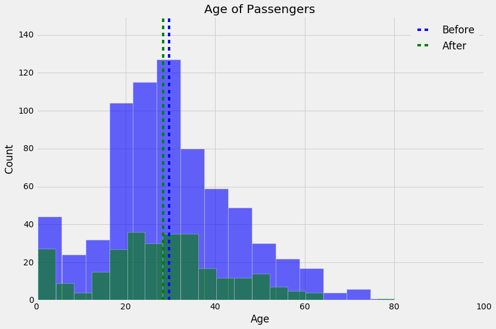
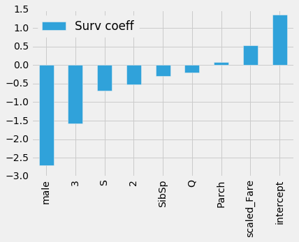
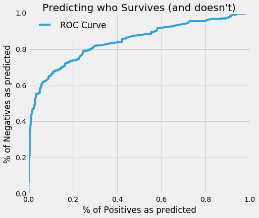

The class was tasked with creating a model that determines who lives and who dies.  In this case, we were trying to deterine which passengers would live and which would die.  We used a dataset which we assume was representative of the entire ship's passenger manifest.  Although there were some gaps in the data, we used the features which were full and available to us to create models to predict the survivorship.  As a first step we took a look at some of the desciptive analytics, along with a data visualization.  One of the visualizations we were interested in viewing was to get a grasp of how the survivors ages ranged and if there was a real "women and children" priority for rescue boat seats, so we plotted the age distribution "before" and "after".  It demonstrates the decrease in the median age as we suspected, and this analysis could be applied to the other differentiating features.  

After getting a grasp of the descriptive statistics and factors, we then went into the model formulation.  We ran several different methods to determine the most important features of the model, and were able to graphically represent that through a bar chat showing the most significant factors' weightings.  

The one thing which really stands out is how much of a disadvantage it was to be a male when trying to survive.  Sex is the most important factor in determining survivorship, followed by Class... 2nd and 3rd class passengers had a greater prediliction to die than 1st class passengers.  Finally we took a look at the performance of the model using the ROC curve visualization.  As you can see from the following graphic, the ROC curve looks very good, the model does seem to have good predictive power above the "flipping the coin" model.  

There are obvious improvements which we could do to help the effectiveness of our model and address data shortcomings.  The one point which I would like to review and address would be the age data.  Ideally we would be able to use logistic regression, KNN, or another model (or even a naive mean age for the specific sex/class/embark data point) to predict the ages of the passengers with missing information and then use the "more complete" dataset to make more accurate survivorship predictions.  Also, we could incorporate several of the newer modeling techniques we learned suchs as decision trees and bagging and boosting.  Unfortunately, this week's project had external time pressures, but these things would be something we would look to do in subsequent projects.  