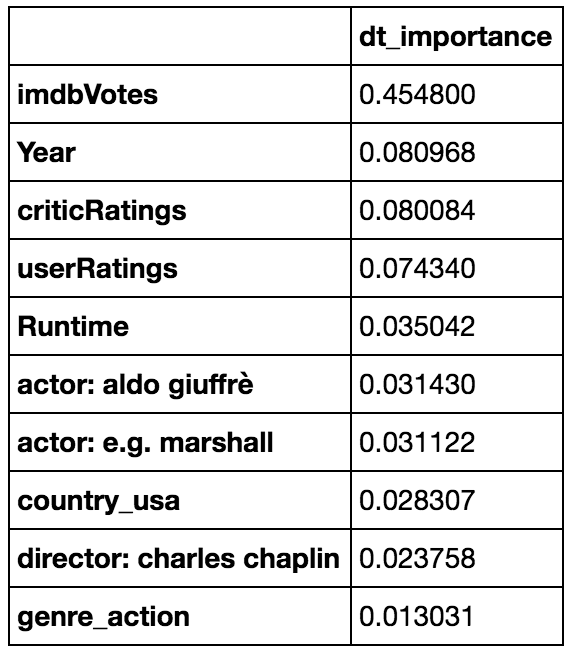
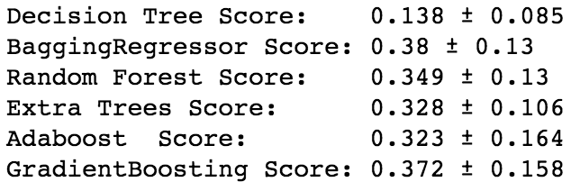
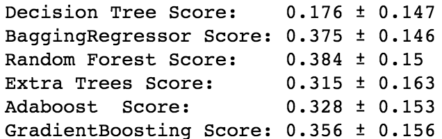
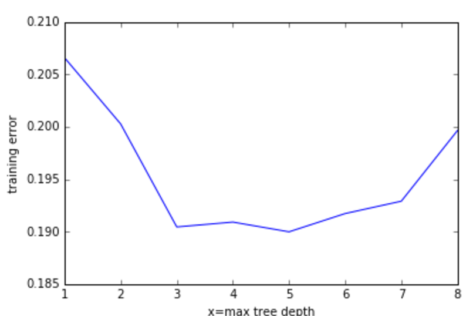

The class was tasked with using decision tree models to come up with a good model to predict movie ratings.  Data was not given, but it was suggested that we start with the imdb top 250 movies and go from there.  After a quick look at the data that was available through the suggested IMDBpie api feed, I assumed the majority of the data would have to be painfully scraped from the IMDB website; IMDBpie's information was sorely lacking, even the list of the top 250 movies would have been more easily gathered and formatted simply by scraping the appropriate page on the IMDB website.  And so I diligently mined the html code for tags and text and went about getting the data in a systematic, methodical way.  That was a mistake.  I didn't realize just how inconsistent data was on the IMDB movie pages, not to mention the legal issues involved (evidently IMDB is not too keen on sharing their info).  So after struggling through 5 days of trying to find the right tags, I realized that there was a good IMDB data api available... just not IMDBpie, but rather OMDB.  So, after taking several deep breaths, I started over.  The data was much more consistent, accurate, and easier to manipulate, but not as comprehensive as I had hoped for.  So I went back and scraped the data that i wanted included, but upon inspection, the data scraped from the website (budget and gross numbers), were incomplete and had to be dropped.  So web-scraped data once again foils my efforts once again.  

So after taking several deep breaths, I started the analysis.  Looking at the nature of the project, I decided to use regressor models and ran them as a batch (decision trees, bagged decision trees, random forest, extra trees, adaboost, and gradient boost), and started by looking at feature importance for all of the models.  I've posted one of the feature models immediately below, but the top 5 features remained consistent throughout all the models.  

I created a new dataset to reflect the features and tested them to make sure they captured most of the effects of the original (full) dataset.  So the scores of the full set of features are as follow:

Changing to the dataset with the features as specified in the feature selection step, we get the following set of scores.

We also tried running a gridsearch to optimize the hyperparameters, but after getting results for the Decision Tree Regressor model, we tried it on the other models, only to get stuck in the calculations.  Since time was running out, I decided to press ahead with just the decision tree regressor models, but if we were afforded more time, we would look to run gridsearch cv to completion on all the models.  In the meantime, let's look at the data visualization for decision trees as per the graph below.  As we can see, there seem to be several maximum depths that would give good results, but having a max depth of '5' seems to be a touch better than the rest.  

I took a look at adding the TF-IDF tools we learned and found some improvement, but the main issue remains the data.  Seeing that I now have an easy way to pull the relevant information about movies through the OMDB api, I should have looked to accrue a larger set of movies, rather than the suggested top 250.  Having the larger dataset would give us more robust findings with all our models, instead of having a small dataset focused on one small range of scores (top movies) we could have a more fuller range of scores and a more useful model.  

So takeaway thoughts from this project was that the data sourcing/cleaning/munging step was very important - had it been initiated correctly, i believe I could have performed the analyses much better and more comprehensively.  Another takeaway thought was to re-do all the models using the Classifier counterparts, simply to get used to the different functions.  Because, you know, we're all about the learning here.  Seriously.  