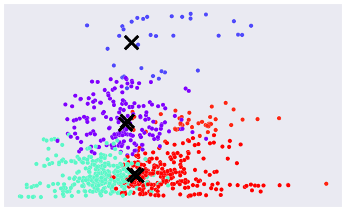
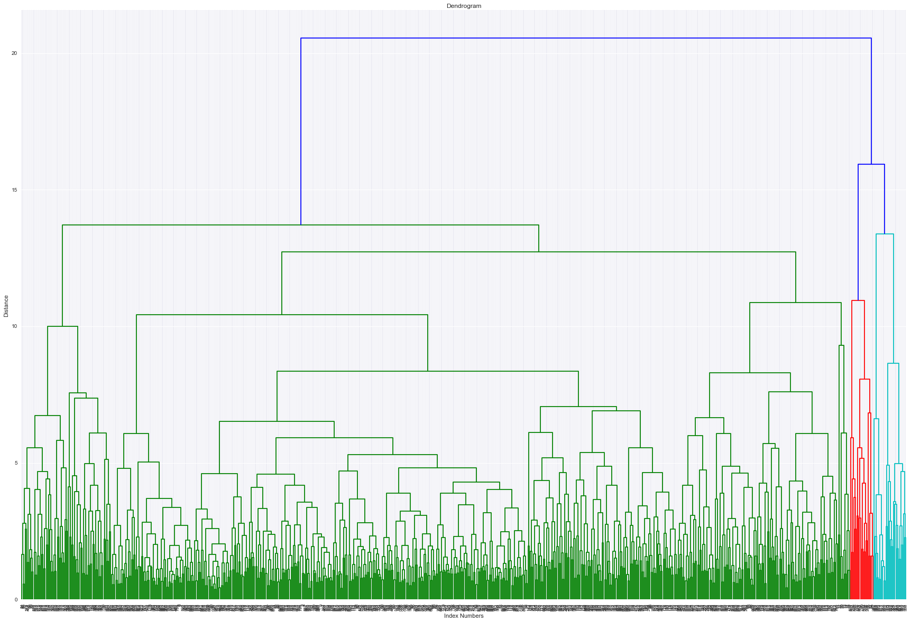
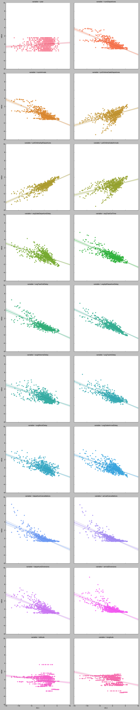

Ah... the last blog post.  I'll look back fondly on these late nights typing something absentmindedly while listening to Steven Colbert on the tv.  As a final weekly project, we were tasked with looking at airplane delay data, given several tables of data through SQL.  Data-munging was thankfully not as terrible as it was for the past few projects, which was really great - more time was spent on the actual modeling and analysis, something which in the past had to be skimped upon due to time concerns.  I compiled all the data tables in psql, then loaded them all into panda dataframes for further analysis.  

It appeared to be a pretty straightforward project - examine how the data is structured, see if there are natural clusters that arise in the data.  Also, look at the delays at airports and see what factors could be addressed to reduce longthy delays.  

We took a look at the data and ran them through our clustering models to see if there were any natural clusters to be found.  There were none.  We ran some basic clustering models and found very low silhouette scores, as demonstrated by the following graph.  

Hierarchical clustering fared a bit better, but as you could imagine it got a bit... bushy towards the ends.  The silhouette score was respectable, with fewer clusters, but a more defined silhouette.  

So hierarchical clustering looks better.  But perhaps PCA can make things look a bit better.  We ran PCA and found that the majority of the variance could be explained by the first three eigenvalues.  The first principle component looks to be particularly effective, capturing most of the variance of the features as demonstrated in the following graphs.

The silhouette scores of the clustering models were mixed after the PCA - the K-Means silhouette score is dramatically improved whereas the hierarchical clustering silhouette score was basically the same (okay a teeny bit better).  But looking at the logistic regression and random forest models used to predict FAA region and long/short delays, we find that the original feature dataframe had a much better result (as defined by accuracy score).  And also, we find that adding the PC factors to the original features dataframe leads to an even better result (although that analysis was mistakenly deleted late yesterday night (in a fit of idiocy)).  In a nutshell, we find that the features that were most important in determining short delays versus long delays are average taxi time out, departure diversions, and average gate arrival delay, so addressing these three factors will help lesson the length of delays.  Now as per the benefit of PCA for model accuracy or effectiveness, I'm not quite sure how to address that... as discussed above, the clustering models seemed to work better, but the logistic regression and random forest models didn't work as well.  It did provide another, interesting way to analyze and look at the data, but it didn't look like the most effective way after doing the classifier results. Although the PCA and original features dataframe together did seem promising, it seems a bit superfluous... it would be better just to use the original set of features as the PCA would be a bit repetitive.  Anyway an interesting question which will be asked at an upcoming office hours session.  