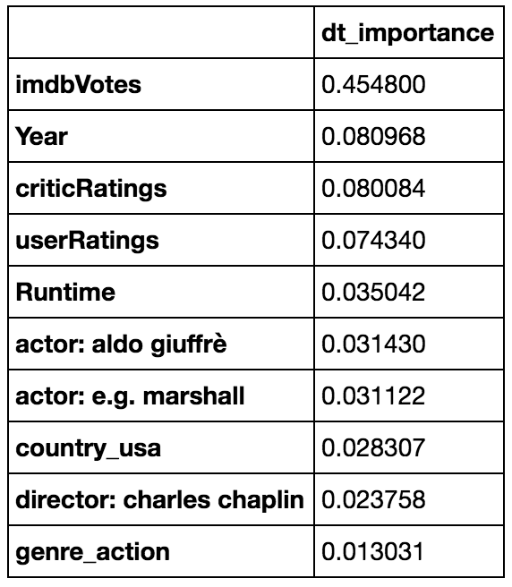
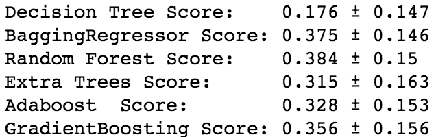
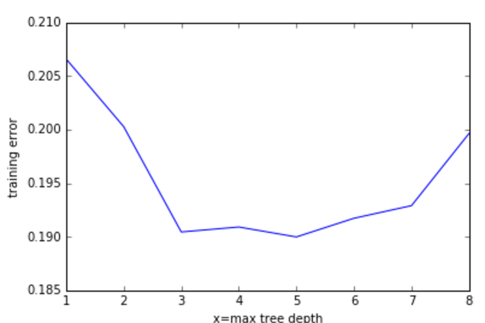

Ah... the last blog post.  I'll look back fondly on these late nights typing something absentmindedly while listening to Steven Colbert on the tv.  As a final weekly project, we were tasked with looking at airplane delay data, given several tables of data through SQL.  Data-munging was thankfully not as terrible as it was for the past few projects, which was really great - more time was spent on the actual modeling and analysis, something which in the past had to be skimped upon due to time concerns.  I compiled all the data tables in psql, then loaded them all into panda dataframes for further analysis.  

So after taking several deep breaths, I started the analysis.  Looking at the nature of the project, I decided to use regressor models and ran them as a batch (decision trees, bagged decision trees, random forest, extra trees, adaboost, and gradient boost), and started by looking at feature importance for all of the models.  I've posted one of the feature models immediately below, but the top 5 features remained consistent throughout all the models.  

I created a new dataset to reflect the features and tested them to make sure they captured most of the effects of the original (full) dataset.  So the scores of the full set of features are as follow:

Changing to the dataset with the features as specified in the feature selection step, we get the following set of scores.

We also tried running a gridsearch to optimize the hyperparameters, but after getting results for the Decision Tree Regressor model, we tried it on the other models, only to get stuck in the calculations.  Since time was running out, I decided to press ahead with just the decision tree regressor models, but if we were afforded more time, we would look to run gridsearch cv to completion on all the models.  In the meantime, let's look at the data visualization for decision trees as per the graph below.  As we can see, there seem to be several maximum depths that would give good results, but having a max depth of '5' seems to be a touch better than the rest.  

I took a look at adding the TF-IDF tools we learned and found some improvement, but the main issue remains the data.  Seeing that I now have an easy way to pull the relevant information about movies through the OMDB api, I should have looked to accrue a larger set of movies, rather than the suggested top 250.  Having the larger dataset would give us more robust findings with all our models, instead of having a small dataset focused on one small range of scores (top movies) we could have a more fuller range of scores and a more useful model.  

So takeaway thoughts from this project was that the data sourcing/cleaning/munging step was very important - had it been initiated correctly, i believe I could have performed the analyses much better and more comprehensively.  Another takeaway thought was to re-do all the models using the Classifier counterparts, simply to get used to the different functions.  Because, you know, we're all about the learning here.  Seriously.  